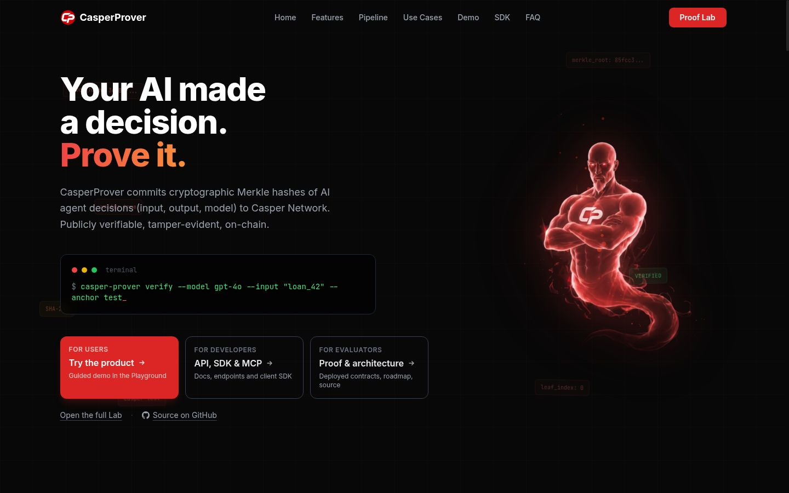
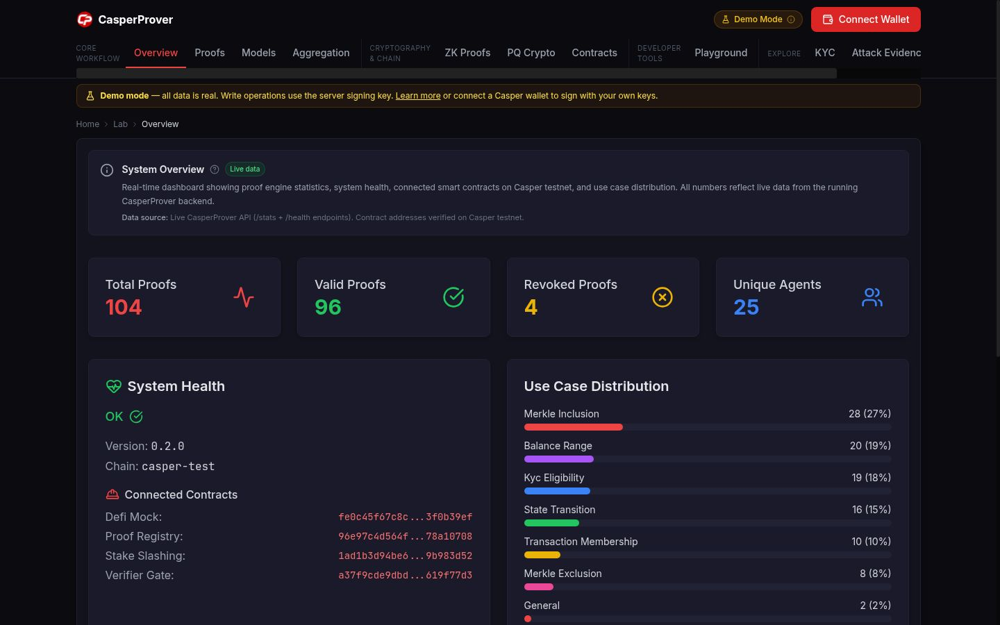
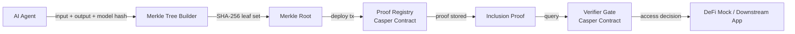

<a id="readme-top"></a>

<div align="center">

# CasperProver

**Cryptographic proof registry for AI agent computations — merkle-verified, on-chain immutable**

*Prove what an agent computed. Verify it on-chain. No replay needed.*

[](https://github.com/anna-stolbovskaja/CasperProver/actions/workflows/check.yml)
[](https://go.dev)
[](https://casper.network)
[](LICENSE)
[](https://casperprover.xyz/lab)

[**Live Demo →**](https://casperprover.xyz/lab) · [Architecture](docs/ARCHITECTURE.md) · [SDK](docs/SDK.md) · [API](https://casperprover-api.onrender.com)

</div>

---

> [!NOTE]
> Three contracts live on Casper testnet. 72 proofs registered. The Go engine generates Merkle-anchored proofs of agent outputs and submits commit hashes on-chain. A downstream DeFi mock contract gates access based on proof validity — working KYC demo included.

## 📸 Screenshots

| Homepage — proof registry | Lab — 72 proofs | Proof detail — Merkle path | KYC-gated DeFi demo |
|---|---|---|---|
|  |  |  |  |

> Live at [casperprover.xyz/lab](https://casperprover.xyz/lab)

---

## Why this matters

AI agents are executing critical workflows — KYC checks, financial decisions, compliance rules. But there is **no audit trail**. You cannot prove what an agent computed without re-running the entire model.

CasperProver closes that gap:

| Without CasperProver | With CasperProver |
|---|---|
| Re-run the model to verify | Verify inclusion proof in milliseconds |
| Trust the agent operator | Verify cryptographically on-chain |
| Black-box outputs | Merkle-anchored, tamper-evident record |
| Centralized log (mutable) | Immutable on-chain commitment |

---

## Architecture



**How it works:**  
Given `f(x) = y` with model `M`, CasperProver produces `π = MerkleProof(H(x), H(y), H(M))` where `H = SHA-256`. The root is committed on-chain; the inclusion proof is stored and queryable forever without re-running the model.

---

## Quickstart

**Prerequisites:** Go 1.22+, access to Casper testnet node

```bash
git clone https://github.com/anna-stolbovskaja/CasperProver
cd CasperProver
cp config.toml.example config.toml   # edit node_url if needed
go mod download
go run ./engine/cmd/...
```

**Submit a proof:**
```bash
curl https://casperprover-api.onrender.com/api/v1/proof/submit \
  -H "Content-Type: application/json" \
  -d '{
    "proof_type": "merkle-inclusion",
    "input_hash": "sha256:abc123...",
    "output_hash": "sha256:def456...",
    "model_id": "gpt-4o"
  }'
```

**Verify a proof:**
```bash
curl https://casperprover-api.onrender.com/api/v1/proof/verify \
  -H "Content-Type: application/json" \
  -d '{"proof_id": "proof_001"}'
# → {"valid": true, "merkle_root": "...", "on_chain_tx": "..."}
```

**Success check:** `{"valid": true}` with a `merkle_root` field means the proof is live on-chain.

---

## Proof Types

| Type | What it proves | Use case |
|---|---|---|
| `merkle-inclusion` | A value was part of a computation | General AI output audit |
| `kyc-eligibility` | Wallet passed KYC (no PII revealed) | DeFi access control |
| `balance-range` | Balance was in a range (no exact value) | Creditworthiness without exposure |
| `transaction-membership` | A tx was processed by a specific agent | Compliance, dispute resolution |

---

## Live Demo

**Lab:** [casperprover.xyz/lab](https://casperprover.xyz/lab)  
72 proofs live on Casper testnet. Filter by proof type, click any row to see the Merkle path and on-chain tx.

**Deployed Contracts (testnet):**

| Contract | Address | Deployed |
|---|---|---|
| Proof Registry | [96e97c4d...a10708](https://testnet.cspr.live/contract/96e97c4d564fe7374ba4e938355fb89f5be2f448decbe9b7727bd3c978a10708) | 2026-06-29 |
| Verifier Gate | [a37f9cde...9f77d3](https://testnet.cspr.live/contract/a37f9cde9dbdc5bb8b9e92c663bdc59b83b42c89dc75ec73f7f7cde2619f77d3) | 2026-06-29 |
| DeFi Mock | [fe0c45f6...0b39ef](https://testnet.cspr.live/contract/fe0c45f67c8cd99f0bda0047399a113588870ec0d79d9102f44107303f0b39ef) | 2026-07-07 |
| Stake Slashing | [cf70e1fe...d9bd1](https://testnet.cspr.live/contract/cf70e1fedf52f250a807e2bece5eccaa3ae12c58115e40393f3d3f77246d9bd1) | 2026-07-07 |

---

## Stake & Slash

`revoke_proof` on Proof Registry was self-revocation only - no real economic
cost for an agent that gets caught submitting a bad proof. The `stake-slashing`
contract adds real skin in the game:

- An agent stakes CSPR (atomically, via the companion `stake-slashing-session`
  session code - one deploy does purse-to-purse transfer + recording, so it
  can't be split or front-run).
- Anyone can permissionlessly call `report_and_slash(agent, proof_id)` once
  that proof is revoked on Proof Registry. It reads Proof Registry's own
  on-chain state via a cross-contract call - it can't force a revocation
  itself, so it can never be used to attack an honest agent.
- A confirmed revocation slashes 20% of the agent's current stake and pays it
  to whoever reported it, as a permissionless monitoring bounty.
- Each `proof_id` can only trigger one slash (tombstoned in a dictionary) -
  no repeated draining of the same revoked proof.

Verified live on testnet 2026-07-07: staked 5 CSPR, an unrelated third-party
account (not the agent, not the deployer) called `report_and_slash` on a
self-revoked test proof and received a real 1 CSPR (20%) bounty; a second
attempt against the same proof_id correctly reverted (`User error: 2`,
already-slashed); `unstake` correctly drained the remaining balance back to
the agent.

## Tech Stack

| Layer | Technology |
|---|---|
| Smart contracts | Rust / Casper 2.x |
| Proof engine | Go 1.22 |
| API | Go HTTP server |
| Frontend | Vite + TypeScript + Tailwind |
| SDK | Go + Python client |
| MCP adapter | Model Context Protocol server |
| Hosting | Vercel (frontend) · Render (API) |
| Chain | Casper testnet (`casper-test`) |

---

## Project Structure

```
CasperProver/
├── contracts/          # Rust smart contracts
│   ├── proof-registry/ # Main proof store
│   ├── verifier-gate/  # Inclusion proof checker
│   └── defi-mock/      # KYC-gated vault demo
├── engine/             # Go proof generation engine
│   ├── cmd/            # Entry point
│   └── internal/       # Merkle builder, Casper client
├── sdk/                # Go + Python SDK
│   ├── client.go
│   ├── mcp_server.go   # MCP adapter for AI frameworks
│   └── python_client.py
├── frontend/           # Vite/TS lab
└── docs/               # Architecture, SDK docs
```

---

## License

[MPL-2.0](LICENSE) · Last verified: 2026-06-30

<div align="right"><a href="#readme-top">↑ back to top</a></div>
