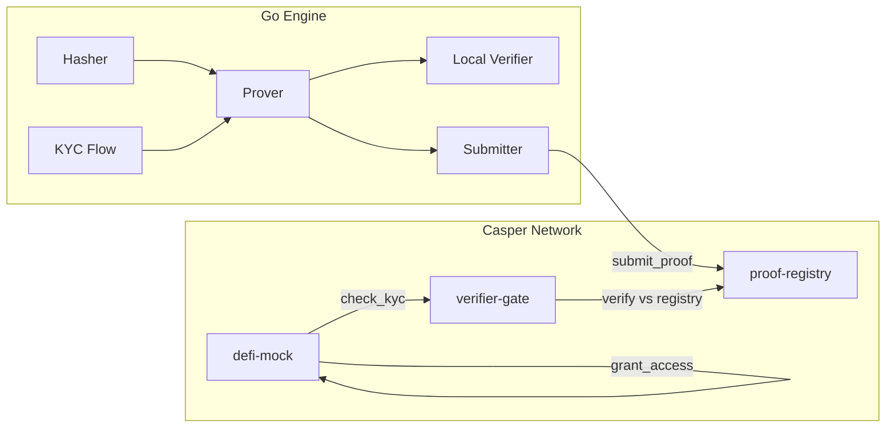

<a id="readme-top"></a>

<div align="center">

# CasperProver

**Verifiable proof layer for AI agent computations on Casper Network**

*Prove what an agent computed. Verify it on-chain. No replay needed.*

[](https://github.com/anna-stolbovskaja/CasperProver/actions/workflows/check.yml)
[](https://go.dev)
[](https://casper.network)
[](LICENSE)

[Landing](https://anna-stolbovskaja.github.io/CasperProver/) · [Architecture](docs/ARCHITECTURE.md) · [SDK](docs/SDK.md)

</div>

---

> [!NOTE]
> Three contracts deployed on Casper testnet. The Go engine generates Merkle-anchored proofs of agent outputs and submits commit hashes on-chain. A downstream DeFi mock contract gates access based on proof validity — working KYC demo included.

---

<details>
<summary>Contents</summary>

- [Spec](#spec)
- [What this solves](#what-this-solves)
- [Quickstart](#quickstart)
- [Architecture](#architecture)
- [Contracts](#contracts)
- [Engine](#engine)
- [API](#api)
- [Tests](#tests)
- [Scope](#scope)
- [Alternatives](#alternatives)
- [Structure](#structure)
- [Author](#author)
- [License](#license)

</details>

---

## Spec

Given an agent computation `f(x) = y` with model `M`, CasperProver produces a Merkle-anchored proof `π`:

```
π = MerkleProof(H(x), H(y), H(M))
```

where `H = SHA-256`. The leaf set `L = {H(x), H(y), H(M)}` forms a binary Merkle tree:

```
        root
       /    \
    h01      H(M)
   /   \
H(x)  H(y)
```

The commit hash `c = root` is submitted to the `proof-registry` contract. Verification requires presenting `(leaf, path, root)` to the `verifier-gate` contract, which confirms membership without replaying the computation.

**Properties:**
- Deterministic: same inputs always produce the same root.
- Compact: proof size is `O(log n)` relative to the number of leaves.
- On-chain verifiable: the contracts store roots and emit verification events.

<div align="right">

[![][back-to-top]](#readme-top)

</div>

## What this solves

AI agents make decisions that affect real assets — KYC approvals, credit scoring, risk assessments. Today there is no standard way to prove *what* an agent computed or *which model* produced the output. CasperProver fills this gap:

1. **Audit trail without replay.** Store a compact proof on-chain. Anyone can verify the agent's input/output/model binding without re-running the model.
2. **DeFi gating on verified computation.** The `defi-mock` contract demonstrates how a lending protocol can require proof verification before granting access — a pattern applicable to KYC, credit, and compliance workflows.
3. **Agent reputation tied to proofs.** The `proof-registry` tracks which agents submitted proofs and maintains per-agent reputation scores. Verifications increase reputation; revocations decrease it.

Comparable systems we found either require full replay (expensive), use opaque attestation services (not independently verifiable), or target ZK circuits (different trust model, much higher complexity). CasperProver sits in the middle: lightweight Merkle proofs with on-chain verification, no trusted setup.

<div align="right">

[![][back-to-top]](#readme-top)

</div>

## Quickstart

Build and run in under 5 minutes. Requires Go 1.22+.

```bash
git clone https://github.com/anna-stolbovskaja/CasperProver.git
cd CasperProver/engine
go build ./cmd/casperprover
```

Run the KYC demo flow:

```bash
./casperprover demo
```

Expected output:

```
[casperprover] generating proof for kyc flow...
[casperprover] root: a1b2c3d4e5f6...
[casperprover] proof valid: true
[casperprover] demo complete
```

Start the API server:

```bash
API_PORT=8080 ./casperprover serve
# -> listening on :8080
```

Verify it works:

```bash
curl http://localhost:8080/health
# {"status":"ok","version":"0.1.0"}
```

> [!TIP]
> The engine runs standalone — no Casper node required for proof generation and local verification. On-chain submission needs `config.toml` with a valid node URL and deployer key.

<div align="right">

[![][back-to-top]](#readme-top)

</div>

## Architecture



*The Go engine hashes inputs, builds Merkle trees, and optionally submits roots to Casper. The verifier-gate contract checks proofs against the registry. The defi-mock contract demonstrates DeFi access gating based on proof validity.*

Full diagrams: [docs/ARCHITECTURE.md](docs/ARCHITECTURE.md)

<div align="right">

[![][back-to-top]](#readme-top)

</div>

## Contracts

All three deployed on Casper testnet.

### proof-registry

Hash: [`96e97c4d...`](https://testnet.cspr.live/contract/96e97c4d564fe7374ba4e938355fb89f5be2f448decbe9b7727bd3c978a10708)

| Entry Point | Description |
|---|---|
| `submit_proof` | Store proof root + metadata |
| `get_proof` | Retrieve by ID |
| `revoke_proof` | Mark proof as revoked |
| `register_agent` | Register agent with reputation |
| `update_reputation` | Adjust trust score post-verification |
| `get_agent` | Query agent data |

### verifier-gate

Hash: [`a37f9cde...`](https://testnet.cspr.live/contract/a37f9cde9dbdc5bb8b9e92c663bdc59b83b42c89dc75ec73f7f7cde2619f77d3)

| Entry Point | Description |
|---|---|
| `verify_proof` | Check proof against registry, emit result |
| `batch_verify` | Verify multiple proofs (max 50) |
| `is_verified` | Query verification status |

Rate-limited: per-caller check to prevent abuse.

### defi-mock

Hash: [`b9b11a97...`](https://testnet.cspr.live/contract/b9b11a976af20b4b5d128c44e5ee118b8830c26a79f4b603cdf0a00e537b81d3)

| Entry Point | Description |
|---|---|
| `check_kyc` | Call verifier-gate for a proof |
| `grant_access` | Whitelist user if proof valid |
| `revoke_access` | Remove user from whitelist |
| `is_whitelisted` | Query whitelist (with tombstone check) |

**Build contracts:**

```bash
cd contracts/proof-registry
cargo +nightly build --release --target wasm32-unknown-unknown --no-default-features

cd ../verifier-gate
cargo +nightly build --release --target wasm32-unknown-unknown --no-default-features

cd ../defi-mock
cargo +nightly build --release --target wasm32-unknown-unknown --no-default-features
```

> Requires Rust nightly (edition 2024).

Security: 18 findings reviewed. Risk score 2/10. See [docs/KNOWN_LIMITATIONS.md](docs/KNOWN_LIMITATIONS.md).

<div align="right">

[![][back-to-top]](#readme-top)

</div>

## Engine

The Go engine is organized as internal packages:

| Package | Responsibility |
|---|---|
| `hasher` | SHA-256 hashing with hex encoding |
| `prover` | Merkle tree construction, proof generation, precomputed proofs |
| `verifier` | Local proof verification (same algorithm as on-chain) |
| `submitter` | Casper RPC client for on-chain submission |
| `kyc` | KYC demo flow: input → proof → verify → whitelist |
| `api` | HTTP server exposing proof operations |

All imports are stdlib or internal. No external Go dependencies.

## API

| Method | Path | Description |
|---|---|---|
| `GET` | `/health` | `{"status":"ok","version":"0.1.0"}` |
| `GET` | `/proofs` | List stored proofs |
| `GET` | `/proofs/{id}` | Get proof by ID |
| `POST` | `/proofs` | Submit new proof |

POST body:

```json
{
  "agent": "agent-id",
  "input": "raw input data",
  "output": "computation result",
  "model": "model-v1",
  "use_case": "kyc"
}
```

Response:

```json
{
  "id": "P-00a1b2c3",
  "root": "e3b0c442...",
  "leaves": ["a1b2...", "c3d4...", "e5f6..."],
  "path": [0, 1],
  "verified": true
}
```

<div align="right">

[![][back-to-top]](#readme-top)

</div>

## Tests

80 total: 22 Rust + 58 Go.

```bash
# go tests
cd engine && go test -race ./...

# contract tests
cd contracts/tests && cargo test --release
```

| Suite | Count | Scope |
|---|---|---|
| `hasher_test.go` | 11 | Hash determinism, empty input, hex encoding |
| `merkle_test.go` | 13 | Tree construction, root stability, edge cases |
| `proof_test.go` | 17 | Proof generation, validation, revocation |
| `local_test.go` | 10 | Local verifier consistency with on-chain logic |
| `defi_flow_test.go` | 7 | End-to-end KYC → proof → whitelist flow |
| `integration_tests.rs` | 22 | Contract entry points, access control, batch limits |

CI: `go test -race` → `go vet` → `golangci-lint` → WASM build → `cargo test`.

<div align="right">

[![][back-to-top]](#readme-top)

</div>

## Scope

| Component | Status | Proof |
|---|---|---|
| proof-registry contract | ✅ deployed | [tx](https://testnet.cspr.live/deploy/d64299b651750b6996595d81b812038750c353f5220b5e61cd6c129e90a07d56) |
| verifier-gate contract | ✅ deployed | [tx](https://testnet.cspr.live/deploy/c1320d182c0323e671183cb7aef603f1bb19b86f97637e3a386ae14dd28422ff) |
| defi-mock contract | ✅ deployed | [tx](https://testnet.cspr.live/deploy/6ed38d8dc4c559080d890a42b2ef5f96144d590ddc8b38856dbfb56d7d92434c) |
| Go prover engine | ✅ working | 58 passing tests |
| KYC demo flow | ✅ working | `casperprover demo` |
| HTTP API | ✅ working | 4 endpoints |
| Go SDK | ✅ available | `sdk/client.go` |
| Python SDK | ✅ available | `sdk/python_client.py` |
| MCP server | ✅ available | `sdk/mcp_server.go` |
| Batch verification | ✅ on-chain | capped at 50 |
| Whitelist revocation | ✅ on-chain | tombstone pattern |
| Recursive proof composition | 🗺 planned | — |
| Multi-model proof trees | 🗺 planned | — |
| Mainnet deployment | 🗺 planned | pending audit |

<div align="right">

[![][back-to-top]](#readme-top)

</div>

## Alternatives

| | CasperProver | Full replay | Trusted attestation | ZK circuits |
|---|---|---|---|---|
| Verification cost | ✅ O(log n) hash checks | ❌ Full compute replay | ⚠️ Trust the attester | ✅ O(1) |
| Trusted setup | ✅ None | ✅ None | ❌ Yes (attester) | ❌ Yes (ceremony) |
| Proof size | ✅ Small (Merkle path) | ❌ Full I/O | ⚠️ Signature | ✅ Constant |
| Implementation complexity | ✅ Low | ✅ Low | ✅ Low | ❌ High |
| Casper-native | ✅ | — | — | ❌ |
| *Where they win* | — | ✅ Bit-exact verification | ✅ Simpler integration | ✅ Strongest cryptographic guarantees |

CasperProver is not a replacement for ZK proofs. It targets a different point in the design space: lower complexity, no trusted setup, sufficient for audit trails and DeFi gating where the threat model is "did the agent run this model on this input?" rather than "prove arbitrary computation."

<div align="right">

[![][back-to-top]](#readme-top)

</div>

## Structure

```
CasperProver/
├── engine/
│   ├── cmd/casperprover/    # CLI + API server entry
│   └── internal/
│       ├── hasher/          # SHA-256 utilities
│       ├── prover/          # Merkle tree, proof generation
│       ├── verifier/        # Local proof verification
│       ├── submitter/       # Casper RPC submission
│       ├── kyc/             # KYC demo flow
│       └── api/             # HTTP server
├── contracts/
│   ├── proof-registry/      # On-chain proof storage (Rust/WASM)
│   ├── verifier-gate/       # On-chain verification (Rust/WASM)
│   └── defi-mock/           # DeFi access gating demo (Rust/WASM)
├── sdk/                     # Go + Python SDKs, MCP server
├── docs/                    # Architecture, SDK, limitations
├── landing/                 # Project landing page
├── .github/workflows/       # CI
├── config.toml              # Node + API configuration
├── Makefile                 # Build shortcuts
└── Dockerfile
```

## Author

**anna-stolbovskaja** — design, engine, contracts ([GitHub](https://github.com/anna-stolbovskaja))

## License

[Mozilla Public License 2.0](LICENSE)

Testnet keys only. Do not commit deployer secrets. See [docs/KNOWN_LIMITATIONS.md](docs/KNOWN_LIMITATIONS.md).

*Verified against commit `check.yml` pass, 2026-06-29.*

[back-to-top]: https://img.shields.io/badge/-BACK_TO_TOP-151515?style=flat-square
