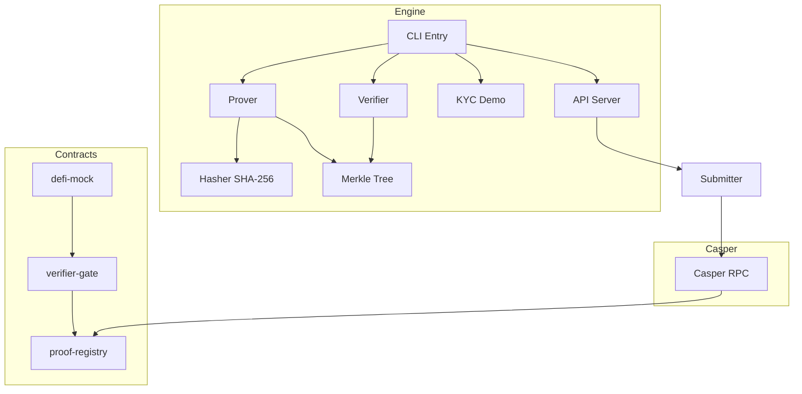
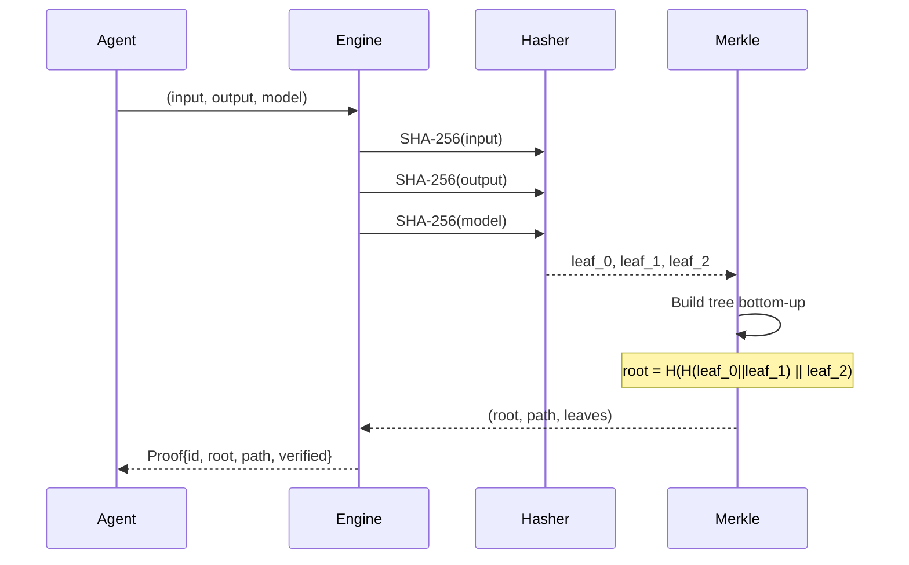
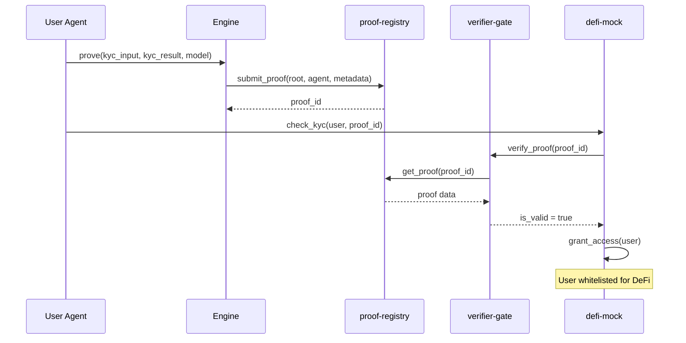

# Architecture

## System Overview



## Proof Generation



## KYC Whitelisting Flow



## Verification Logic

```
Given: leaf L, path P = [p_0, p_1, ...], root R

verify(L, P, R):
    h = H(L)
    for p_i in P:
        h = H(h || p_i)   if index is even
        h = H(p_i || h)   if index is odd
    return h == R
```
